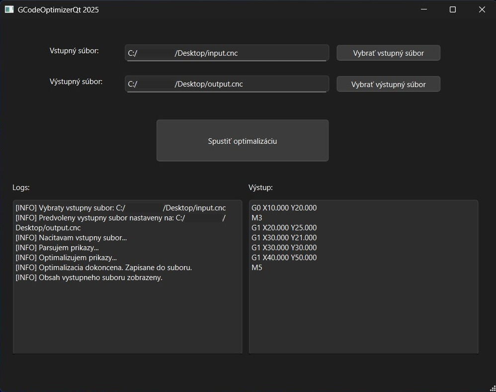

# SimpleGCodeOptimizerQt

Jednoduchá Qt desktopová aplikácia na optimalizáciu G-code súborov pre CNC stroje.
Dátum: 25.4.2025

## Funkcionalita
- Načítanie `.cnc` súboru zo vstupu.
- Parsovanie a validácia CNC príkazov (`G0`, `G1`, `M3`, `M5`).
- Automatická optimalizácia:
  - Odstránenie duplicitných pohybov.
  - Odstránenie návratov na predchádzajúci bod.
  - Odstránenie zbytočného zapnutia/vypnutia horáka.
- Zápis optimalizovaného výstupu do nového `.cnc` súboru.
- Zobrazenie výstupného G-code priamo v aplikácii.

## Použitie
1. Vyberte vstupný súbor cez tlačidlo "Vybrať vstupný súbor".
2. Aplikácia automaticky predvyplní cestu pre výstupny súbor (`output.cnc` v rovnakom priečinku).
3. Kliknite na "Spustiť optimalizáciu".
4. Optimalizovaný G-code sa uloží do výstupného súboru a zobrazí v aplikácii.

## Technológie
- C++17/C++23
- Qt 6 (Widgets)
- STL (fstream, vector, regex)
- Windows 11

## Projekt
Tento projekt vznikol ako testovacia úloha pre optimalizáciu G-code súborov a je pripravený na ďalšie rozšírenie.
